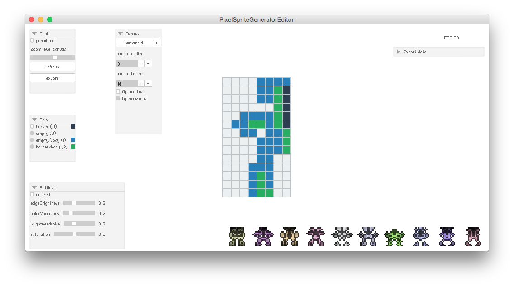

# Pixel-Sprite-Generator-Editor
A quick project to create a editor for Pixel-Sprite-Generator

##About

I currently working on a project with this amazing idea from Dave Bollinger [Pixel Spaceship](http://web.archive.org/web/20080228054410/http://www.davebollinger.com/works/pixelspaceships/).

In one of the haxe feeds that I follow someone mentioned a haxe port from a javascript port of the original work of Dave.

I really love it, and wanted to experiment with it a little bit more.
So I decide to build an editor for it in 8 hours.

This project is not done, and perhaps I will never finish it. 
There are probably a lot of issues with it and currently it only exports to Neko.
But it could be a start of an sprite editor for example :) ..

##Editor

##Libs used

* Haxe procedural sprite generator: https://github.com/Zielak/pixel-sprite-generator
* Haxe port of Keith Peters minimalcomps: https://github.com/Beeblerox/MinimalCompsHX
